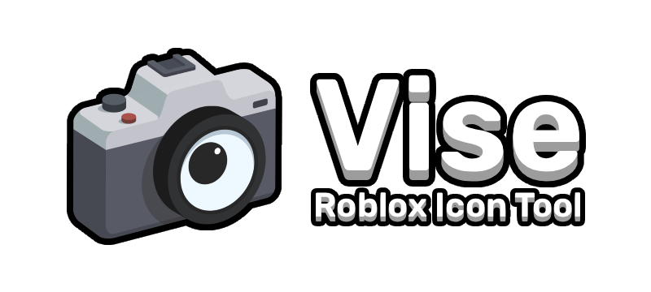
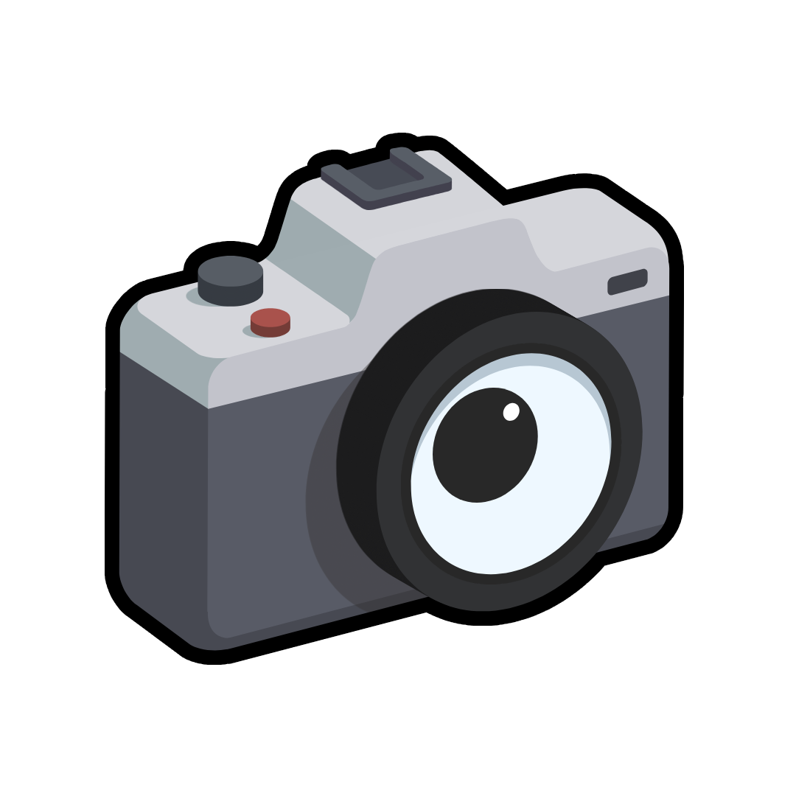

 
# IN DEVELOPMENT

<h1 align="center">Vise, a Icon Tool and Designer for Roblox Studio</h1>

A Roblox plugin with extensible design capabilities within Roblox Studio that records instances of the workspace in real time.

____

  <h2>Acknowledgements</h2> 

 I want to give thanks to the users resources or softwares toward the making of **Vise**
 
 **Graphical Design** ( [JakeyRoundHead](https://github.com/J4KEWasNotHere) )
 
 - All visuals and graphics were designed in
  [ Photopea](https://www.photopea.com/)
 - Font, [Rubik Font by Hubert and Fischer](https://8font.com/rubik-semibold-font/) on [**dafontfree.io**](https://www.dafontfree.io/)
 - Icons, [ Lucide (For Roblox; plugin) by KoteraHQ/@7kayoh](https://gitlab.com/koterahq/luciderblx/plugin) and [ Material Icons (plugin) @qwreey_moe](https://devforum.roblox.com/t/plugin-material-icons-1400/906640)
 
 
 **Backend** ( [JakeyRoundHead](https://github.com/J4KEWasNotHere) )
 
 - Plugin Framework is a modified reposity of [ **PluginEssentials** by mvyasu](https://github.com/mvyasu/PluginEssentials) accompanied by [**Fusion 0.2** by elttob](https://elttob.uk/Fusion/0.2/)
 

___

<h1 align="center"> License & Holder Agreement</h1>

Vise is available under the <kbd>MPL-3.0 License </kbd>. Terms and conditions are available in [LICENSE](https://github.com/J4KEWasNotHere/Vise/blob/main/LICENSE) or at the [Official Website](https://opensource.org/license/gpl-3.0). 

<b>Any public reproduction, replication, or forking of this resource requires the application of this same license and strict adherence to its governing legislation.</b>

